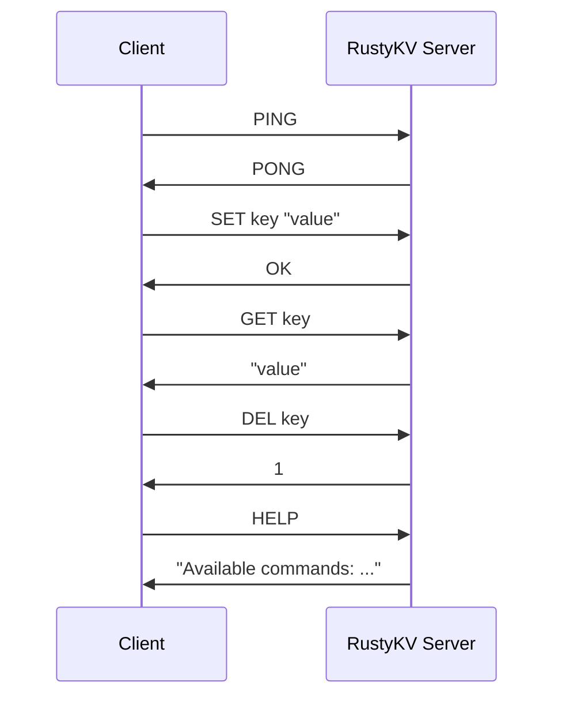
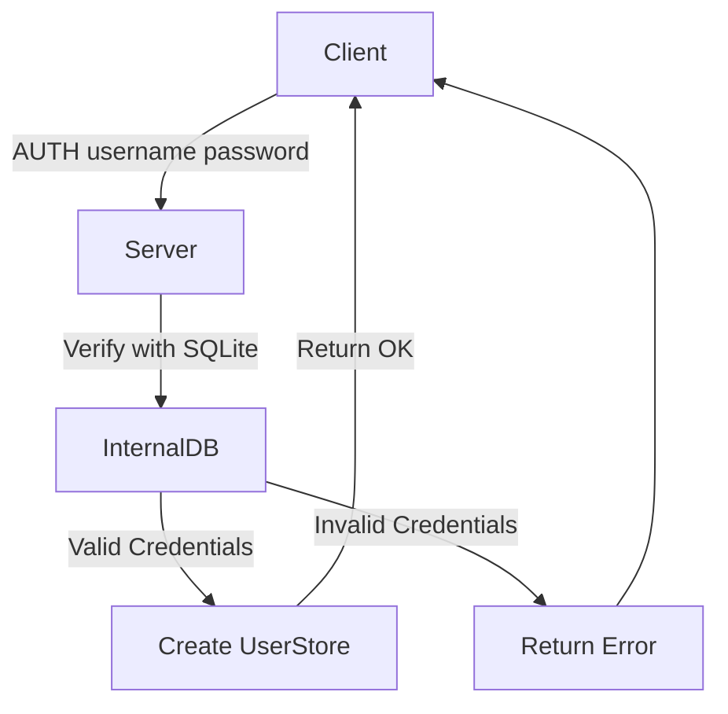
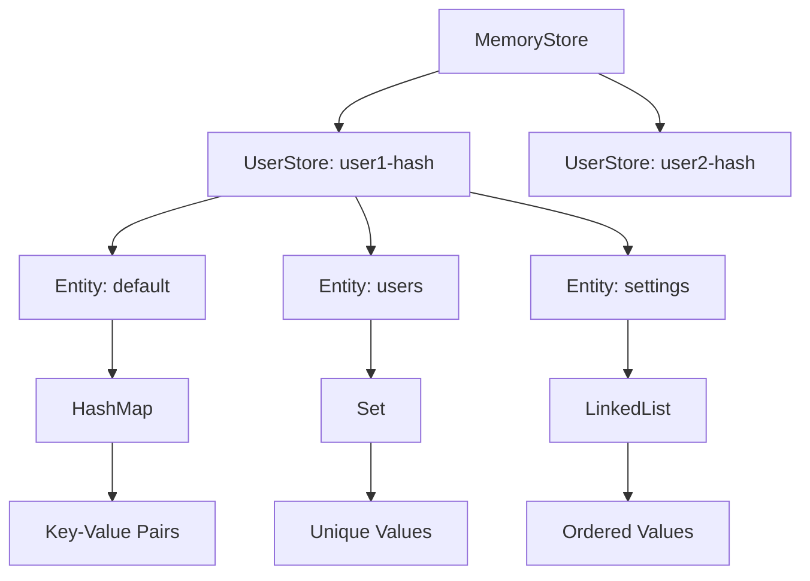
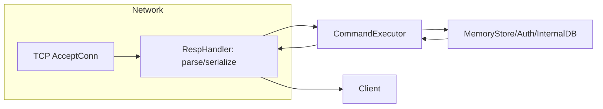

**Author:** Piush Bose  
**Repo:** [rusty-org/rusty-kv](https://github.com/rusty-org/rusty-kv)  
**CLI client:** Included in the [Releases on GitHub](https://github.com/rusty-org/rusty-kv/releases)

---

## 📙 Article Outline

1. Motivation & design philosophy
    
2. High-level architecture with diagrams
    
3. Detailed module walkthrough
    
4. Live code examples
    
5. How to get it running
    
6. Deep-dive: RESP parsing, auth, memory management
    
7. Next steps & contribution guide
    

---

## 1\. Why Rust & Redis Compatibility?

Choosing Rust and speaking the Redis protocol were both deliberate decisions that unlock distinct advantages—here’s how they work together to make Rusty KV powerful, safe, and easy to adopt.

### 1.1 Rust: Safety, Speed, and Concurrency

* **Memory and Thread Safety**  
    Rust’s ownership model and borrow checker eliminate entire classes of bugs at compile time: no null‑pointer dereferences, no use‑after‑free errors, and no data races. This means our core in‑memory engine can freely share state between threads—under the hood it’s all `Arc<…>` and `RwLock`, but you never have to write an unsafe line.
    
* **Zero‑Cost Abstractions**  
    High‑level features like iterators, traits, and async/await compile down to highly optimized machine code. Rust gives you the expressiveness of modern languages without sacrificing performance; benchmarks often show it rivaling—or in some cases beating—C or C++ on raw throughput.
    
* **Asynchronous I/O with Tokio**  
    Handling thousands of concurrent connections is straightforward with Tokio’s async runtime. We use non‑blocking sockets and a lightweight task scheduler so each client gets reactive, low‑latency performance without spawning a thread per connection.
    

---

### 1.2 Redis RESP Protocol: Instant Ecosystem Compatibility

* **“Speak Redis, Play Everywhere”**  
    RESP (Redis Serialization Protocol) is a simple, text‑based wire format that 200+ Redis clients already understand. By implementing RESP in Rusty KV, you can plug in any existing client—Python, Go, JavaScript—without writing new drivers or libraries.
    
* **No Translation Layer**  
    Rather than inventing our own protocol and adapter, we parse and emit the exact same messages Redis servers do. That means tools like `redis-cli`, `redis‑exporter` for Prometheus, and most orchestration scripts work out of the box.
    
* **Minimal Overhead**  
    RESP’s line‑oriented design is easy to parse in Rust—our `resp` module reads byte buffers into a `Value` enum in constant time per token. Likewise, serializing back is just pattern‑matching on that enum. There’s virtually no CPU wasted on protocol gymnastics.
    

---

### 1.3 Secure Multi‑Tenancy: Ownership and Isolation

* **Per‑User Namespaces**  
    Every successful `AUTH` call spins up a fresh `UserStore` instance, keyed by a cryptographic credential hash. That store is a scoped bucket for all subsequent commands, so Alice’s keys can never collide with Bob’s—and one user can’t read another’s data.
    
* **Strong Password Hashing (Keccak‑256)**  
    We never store plain‑text passwords. When you create or authenticate a user, we hash your password with Keccak‑256 (the same primitive underlying SHA‑3) before inserting or matching it in our SQLite credentials database.
    
* **Thread‑Safe Isolation**  
    Under the hood, `MemoryStore` is an `Arc<RwLock<HashMap<CredHash, UserStore>>>`. Inside each `UserStore`, individual `Entity` maps (HashMap, Set, etc.) are also wrapped in `RwLock`. This layered locking strategy guarantees that two connections from the same user can safely interleave reads and writes, while connections for different users operate entirely on disjoint state.
    

By combining Rust’s guarantees with an industry‑standard wire protocol and robust multi‑tenant design, Rusty KV delivers a production‑ready key‑value store that’s both high‑performance and secure—without forcing you to rewrite your tooling or compromise on safety.

---

## 2\. Architecture at a Glance

Here's a visual breakdown of core components and data paths, powered by a standard Redis‑style message flow:



### The authentication flow



### **📦 Memory Store Architecture**

The `MemoryStore` implements a sophisticated multi-user data isolation system:

* **Top Level**: `MemoryStore` contains a map of user credential hashes to `UserStore` instances
    
* **User Level**: Each `UserStore` contains named entities (data structures)
    
* **Entity Level**: Each entity is a specific data structure (HashMap, Set, LinkedList)
    
* **Data Level**: The actual key-value pairs within each data structure
    

This layered approach provides:

1. Complete data isolation between users
    
2. Type-specific operations for different data needs
    
3. Thread-safety with `Arc`, `Mutex`, and `RwLock` primitives
    
4. Namespace organization with dot notation (e.g., `hashmap.key`)
    



**Key Components**

* **TCP Listener (Tokio):** handles client connections.
    
* **RESP Handle**[**r:** par](https://github.com/rusty-org/rusty-kv)ses incoming data into `Value` enums, serializes responses.
    
* **Command Executor:** dispatches commands like `GET`, `SET`, `AUTH`.
    
* **MemoryStore:** holds `UserStore` instances indexed by credential hash.
    
* **UserStore:** namespace‑scoped, thread‑safe storage of various entities (`HashMap`, `Set`, `LinkedList`).
    
* **InternalDB:** SQLite‑based creden[tials](https://github.com/rusty-org/rusty-kv) mana[gement](https://github.com/rusty-org/rusty-kv) using `rusql`[`ite`, s](https://github.com/rusty-org/rusty-kv)ecure Keccak‑256 hashing.
    

---

### ✨ Features

Rusty KV Store is more than just GET/SET:

* **TCP server** with **async I/O** (Tokio)
    
* **RESP protocol** compatibility (all Redis clients work out of the box)
    
* **Command handling** architecture
    
* **In‑memory storage** with async access
    
* **Implemented commands:**
    
    * `PING` – test connectivity
        
    * `ECHO` – echo messages
        
    * `SET`, `GET`, `DEL` – basic key operations
        
    * `HELP` – list available commands
        

---

### 🗄️ SQLite Database Usage

Although all key‑value data is purely in‑memory, **user credentials** persist via SQLite:

* **Users table:** `id`, `username`, `password` (Keccak‑256 hash), `created_at`, `updated_at`, `root_user`
    
* **Connection pooling:** via `r2d2`
    
* **Backup support:** configurable intervals & paths
    
* **Auto‑migrates schema** at startup
    

---

### 🔄 RESP Protocol Implementation

RESP (Redis Serialization Protocol) powers client‑server messages:

* **Value types:** SimpleString, BulkString, Integer, Boolean, Array, Null, Error
    
* **Parser:** raw TCP → `Value` enum
    
* **Serializer:** `Value` → wire format
    
* **Performance:** constant‑time per token, zero-copy wherever possible
    

---

### 🛠️ Configuration Management

Rusty KV reads settings from a **TOML** file plus **environment overrides**:

* Typed retrieval & dot‑notation access
    
* Defaults for network, database path, logging levels
    
* Flexible for production or local dev
    

---

## 3\. Module Walkthrough

### a) **resp** module

Central to protocol handling:

```rust
pub enum Value {
    SimpleString(String),
    BulkString(String),
    Integer(i64),
    Boolean(bool),
    Array(Vec<Value>),
    Null,
    Error(String),
}
```

* **Parser**: uses byte-level scanning to convert raw TCP streams to `Value`.
    
* **Serializer**: circular s[ignal](https://github.com/rusty-org/rusty-kv) generation per RESP spec.
    

### b) **auth** module

Secure user login flow:

```rust
let hash = keccak256(&password);
let row = conn.query_row(
    "SELECT id FROM users WHERE username = ?1 AND password = ?2",
    params![username, hash],
    |r| r.get(0))
```

* On success: generates a credential token, binds a `UserStore` to it, returns `+OK`.
    

### c) **store** module

Core in-memory engine:

```rust
struct MemoryStore {
  inner: Arc<RwLock<HashMap<CredHash, UserStore>>>
}
```

* `UserStore` manages Entities by name using `RwLock<HashMap<_, Box<dyn Entity>>>`.
    
* Supports concurrent reads/writes safely via Rust sync primitives.
    

### d) **command\_executor**

Each command is implemented with type-preserving logic:

```rust
fn execute(&self, args: &[Value], user_store: &UserStore) -> Value { ... }
```

E.g., `SET` stores a typed `Value`, `GET` retrieves it, and `DEL` removes it. Type preservation avoids silent conversions.

---

## 4\. Control Flow Diagram



This illustrates how the system manages authentication, command dispatch, and storage access per connection.

---

## 5\. Quickstart – Run it Yourself

```bash
git clone https://github.com/rusty-org/rusty-kv.git
cd rusty-kv
cargo run --release
```

Default server listens on `127.0.0.1:6379`. Use standard Redis CLI:

```bash
redis-cli
> AUTH alice hunter2
+OK
> SET foo "bar"
+OK
> GET foo
$3
bar
> PING
+PONG
```

The CLI client in Releases (`rusty-kv-cli`) offers an enriched experience.

---

## 6\. Deep-Dive Highlights

### • 6.1 RESP parsing

RESP handling lives in `resp/mod.rs`. Each command is parsed in constant time, using pattern matches per RESP spec.

### • 6.2 Auth & Credential Hashing

Passwords are never stored plain—`Keccak256` is applied before SQLite storage. Connection attempts without `AUTH` return errors.

### • 6.3 Memory Isolation

Each user gets a private store. Access between users is impossible:

```rust
let map = store.inner.read().unwrap();
let user_store = map.get(&cred_hash).unwrap();
```

This ensures tenant data isolation.

### • 6.4 Type-Preserving Pipeline

Unlike Python or JS, Rust’s `Value` enum retains types end-to-end. Conversion to string only for backward compatibility.

```rust
match value {
    Value::Integer(i) => BulkString(i.to_string()),
    …
}
```

---

## 7\. What’s Next?

* ✅ **Planned Persistence**: Snapshotting `.kdb` files plus `KDB SAVE / LOAD` commands.
    
* ✅ **Additional Entities**: e.g., Sorted Set, Stream.
    
* ✅ **CLI Enhancements**: Built-in tab-completion, logging verbosity.
    
* ✅ **Benchmarks**: Compare performance vs Redis under concurrent load.
    

---

## 📢 Call to Action

This project exemplifies Rust’s capabilities in systems programming, secure storage, and protocol design. You’re invited to:

* 🔍 **Explore the code** on [rusty-org/rusty-kv](https://github.com/rusty-org/rusty-kv)
    
* 🛠️ Tackle open issues and roadmap items in `TODO.md`
    
* ⭐ Star, fork, and spread the word!