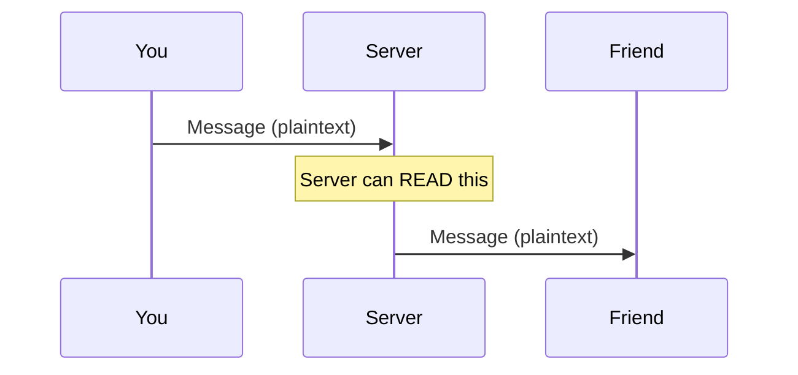
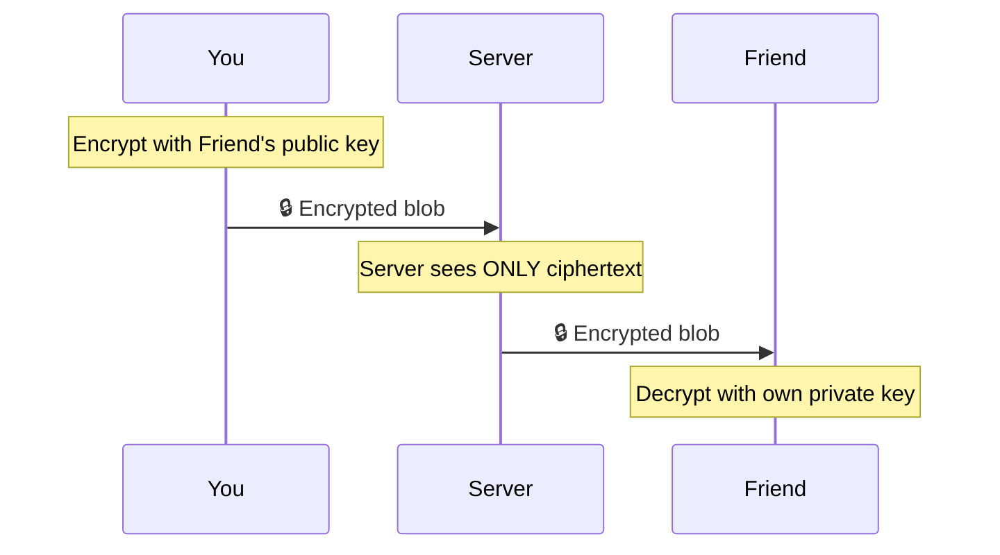
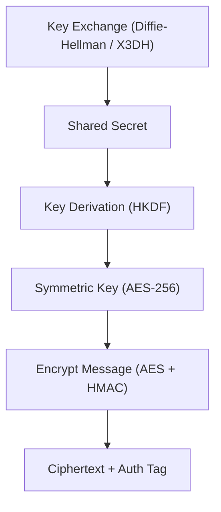
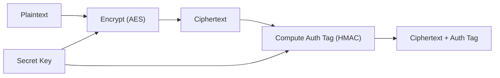
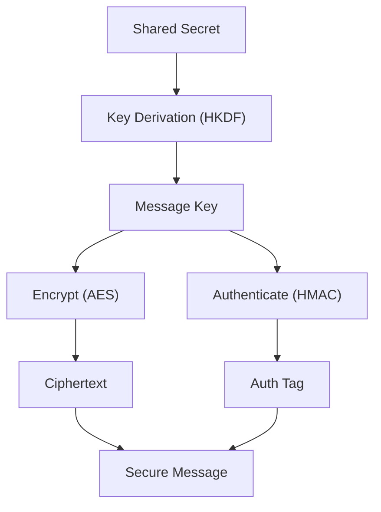
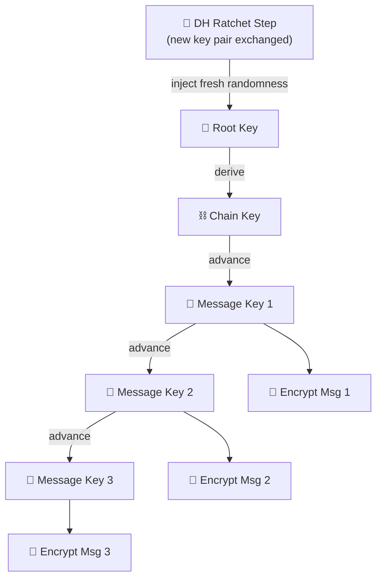
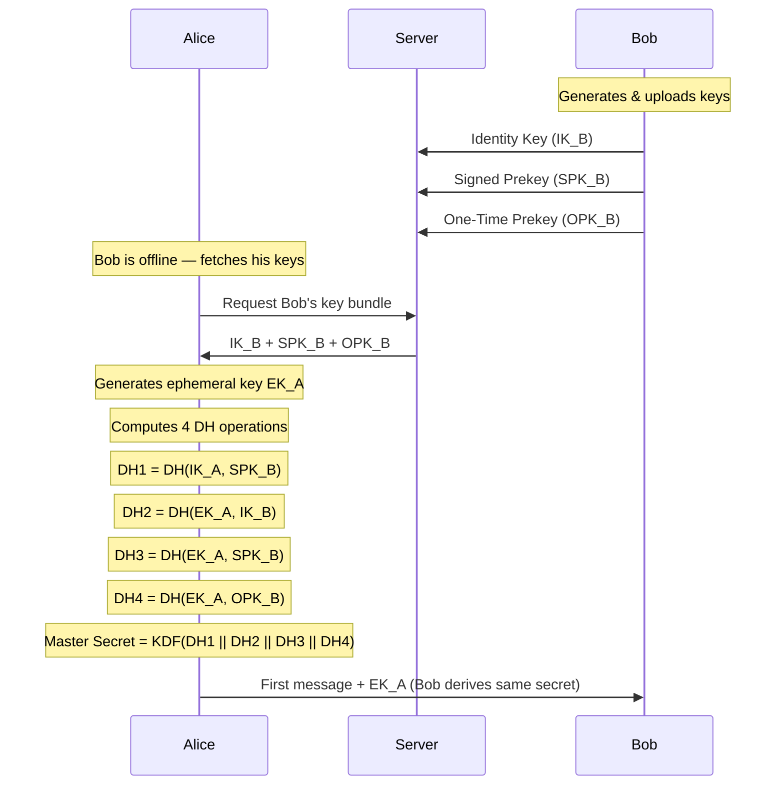
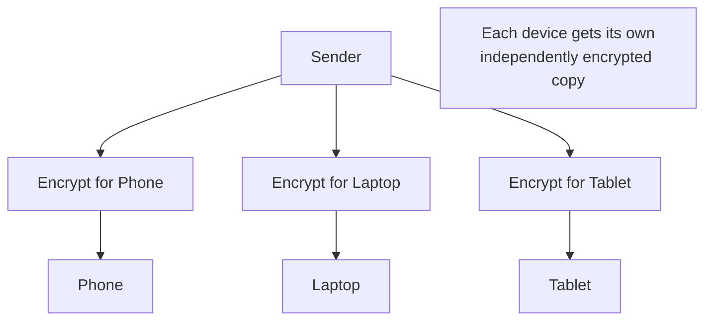

# How WhatsApp Secures Your Messages: A Deep Dive into End-to-End Encryption

## Table Of Contents

1. TL;DR
2. Intro
3. What End-to-End Encryption Actuall Means (A Simple Mental Model)
4. How A Secure Conversation Starts (High Level Key Exchange)
5. Core Building Blocks AES, Diffie Hellman, and Why We Need Both
6. Message Security (AEAD, Intergrity)
7. How Chats Stay Secure Over Time (Double Ratchet)
8. WhatsAPP Specific Implementation Scale (Why This Is Hard At Billions Of Messages)
9. Post-Quantum Future Conclusion

### TL;DR

<!-- > [!TL;DR]
> Now, one thing to remember, this article is about how whatsapp handles end-to-end encryption, not about how encryption algorithms like RSA or anything im going to talk about later on this article works, or how key exchange-algorithms like Diffie Hellman works, this is solely based on how whatsapp handles everything while keeping our old chats secure. -->

<div data-node-type="callout">
<div data-node-type="callout-emoji">⁋</div>
<div data-node-type="callout-text">Now, one thing to remember, this article is about how whatsapp handles end-to-end encryption, not about how encryption algorithms like RSA or anything im going to talk about later on this article works, or how key exchange-algorithms like Diffie Hellman works, this is solely based on how whatsapp handles everything while keeping our old chats secure.</div>
</div>

## Intro 

Let's read a conversation first before starting the actual article. The conversation was a very real one for me, i had this conversation years before i joined college, and yet here i am teaching you guys what is it.

> Me -> Friend: Hey, what's up? <br>
> Friend -> Me: Nothing, just chilling <br>
> Friend -> Me: What about you ?? <br>
> Me -> Friend: I am working on the next big project which i think can make me MILLIONS!! <br>
> Friend -> Me: Tell me, what is it ? <br>
> Me -> Friend: Can't tell you, at least over internet, some one can steal this from me ! <br>
> Friend -> Me: Huh, dummy, ever heard of E2EE ? <br>
> Me -> Friend: Nah, but what's that ?? <br>
> Me -> Friend: Either ways, i'm not going to share the idea with you !! <br>
> Friend -> Me: Fine, whatever... <br>

So, according to my friend he knew something called E2EE, which is supposed to secure our communication between me and my friend. Similar thing we can observe in whatsapp as well. RIGHT ??? Something like this 


So, what is it ? I mean, no seriously, what is it ?? Now i am intrigued. So it turns out that whatsapp and other messnger apps like whatsapp such as **Signal** & **Facebook Messenger** also uses something similar, based on the same principal. The main goal of that is to secure our communication over public internet in such a way that even though if I lose my phone or my friend does, after loggin in with our credentials we can see our old messages but yet those were not saved in any kind of actual database in the same way we can read those messages also no one besides us can read those messages even though if someone tries to listen to our netwrok chatter or tries to attack the same network which I or my friend is inside then all they hear or see is some kind of spoofed or scrambled data, which they won't be able to figure out the meaning of or put back together to make a meaning out of it.

So by **E2EE** we actually mean **End to End Encryption** which is the model whatsapp and other messengers like whatsapp uses to secure our communications.

So let's try to understand how whatsapp keep our communications encrypted while having an active user base of over **"2.3 Million"** and handling over **"40 Billion"** messages on a daily basis.


---

## What End-to-End Encryption Actuall Means (A Simple Mental Model)

Before we talk about algorithms, keys, or protocols, let’s answer a much simpler question:

> What does “end-to-end encryption” actually mean?

Because this phrase gets thrown around a lot, but most people misunderstand what is really happening under the hood.

### The Normal Way Communication Works (Without E2EE)
In a typical system, when you send a message:
1. You type a message
2. It is sent to a server
3. The server processes and stores it
4. The receiver fetches it from the server

So the flow looks like this:



Now here’s the important part:
- The server can read your message
- Anyone who compromises the server can read your message
- Anyone intercepting poorly secured traffic might read your message

In this model, the **server is part of the trust boundary**

### What Changes with End-to-End Encryption
With E2EE, the flow changes fundamentally:



But the key difference is:
- The message is **encrypted before it leaves your device**
- It is **decrypted only on your friend’s device**

So now:
- The server only sees encrypted data
- Even WhatsApp cannot read your messages
- Even if the server is hacked, messages remain unreadable
### The “Lock and Key” Analogy
A simple way to think about this:
- You put your message in a box
- You lock it using a key only your friend can open
- You send the locked box through the internet
- Your friend unlocks it on their device

At no point does the “delivery system” (servers, routers, etc.) have the key.
### What Exactly Is Protected?

E2EE ensures three critical things:
#### 1. Confidentiality
Only you and the recipient can read the message.
Even the service provider cannot see the contents.
#### 2. Integrity
The message cannot be modified in transit without detection.
If someone tampers with it, the receiver will know.
#### 3. Authenticity
You can be sure the message came from the person you think it did.
Not from an attacker pretending to be them.

### What E2EE Does NOT Hide
This is where many people get it wrong.
Even with E2EE, some information is still visible:
- Who you are talking to
- When you are talking
- How often you send messages
- Message sizes (roughly)

This is called **metadata**, and E2EE does not fully hide it.

### The Role of the Server in E2EE Systems
If the server cannot read messages, what does it even do?
It still plays an important role:
- Relays encrypted messages
- Stores messages temporarily (if the recipient is offline)
- Distributes public keys
- Helps establish connections

But importantly:
> The server is no longer trusted with your data

It becomes a **transport layer**, not a data owner.

### Why This Model Matters
This shift is huge.
In traditional systems:
- You trust the platform

In E2EE systems:
- You trust the **cryptography and your device**

This is why even if:
- WhatsApp servers are compromised
- Governments request data
- Attackers intercept traffic

The actual message content remains secure.

### Where We Go Next
Now that we understand what E2EE guarantees, the next question becomes:
> How do two people who have never met… actually start communicating securely?
Because encryption is useless unless both sides somehow agree on a shared secret.
That’s exactly what we’ll explore next.

---
## How A Secure Conversation Starts (High Level Key Exchange)
Before we talk about encryption algorithms or fancy ratchets, there’s a very basic problem we need to solve:
> **How do two people agree on a secret… over a public internet… without anyone else seeing it?**

Because think about it:
- You and your friend have never met
- You’ve never shared any password before
- Everything you send goes through servers, routers, ISPs…

So how do you _start_ securely?

### The Core Problem
Let’s go back to your story.
You:
> “I have a million-dollar idea… but I can’t send it online”

Your friend:
> “Use E2EE”

Cool… but how?
If you just send a key like this:
Key = 12345
Anyone listening can steal it.
So we need a way to:
- **agree on a shared secret**
- without ever directly sending that secret

### The Idea: “Public vs Private”
Every user in WhatsApp (or similar systems) has:
- a **public key** → can be shared with anyone
- a **private key** → must NEVER leave the device

Think of it like:
- Public key = your _lock_
- Private key = your _key_

You can give your lock to anyone…  
but only you can open it.

### What Actually Happens (Simplified Flow)
When you send a message to your friend for the first time:
1. You fetch your friend’s **public key** (from WhatsApp server)
2. You use:
    - your private key
    - their public key
3. You compute a **shared secret**

Your friend does the same:
- their private key
- your public key

Both of you end up with the **same secret key**
BUT…
That key was **never sent over the network**

### Why This Works
This is based on algorithms like:
- Diffie-Hellman (DH)
- Elliptic Curve Diffie-Hellman (ECDH)

You don’t need the math here—just the intuition:

> “Two people mix their secrets in a way that produces the same result… but no one else can reverse it.”

### A Tiny Go Example (Mental Model, Not Production)
Let’s simulate this idea in a _very simplified_ way.

> This is NOT real crypto — just to build intuition.

```go
package main  
  
import (  
	"crypto/sha256"  
	"fmt"  
)  
  
// pretend "private key"  
func generatePrivateKey(name string) []byte {  
	hash := sha256.Sum256([]byte(name))  
	return hash[:]  
}  
  
// pretend "public key"  
func generatePublicKey(private []byte) []byte {  
	hash := sha256.Sum256(private)  
	return hash[:]  
}  
  
// simulate shared secret  
func deriveSharedSecret(myPrivate, theirPublic []byte) []byte {  
	data := append(myPrivate, theirPublic...)  
	hash := sha256.Sum256(data)  
	return hash[:]  
}  
  
func main() {  
	// Alice  
	alicePrivate := generatePrivateKey("alice-secret")  
	alicePublic := generatePublicKey(alicePrivate)  
  
	// Bob  
	bobPrivate := generatePrivateKey("bob-secret")  
	bobPublic := generatePublicKey(bobPrivate)  
  
	// Both derive shared secret  
	aliceShared := deriveSharedSecret(alicePrivate, bobPublic)  
	bobShared := deriveSharedSecret(bobPrivate, alicePublic)  
  
	fmt.Printf("Alice Shared: %x\n", aliceShared)  
	fmt.Printf("Bob Shared:   %x\n", bobShared)  
}
```

Output:
> Alice Shared == Bob Shared

Even though:
- Alice used her private key + Bob’s public key
- Bob used his private key + Alice’s public key
### How WhatsApp Does It (Real World Hint)
In reality, WhatsApp uses something more advanced:
- **X3DH (Extended Triple Diffie-Hellman)**
- Prekeys stored on the server
- Works even if your friend is **offline**

This is what allows:
> You send a message → your friend opens later → still secure

---

## Core Building Blocks: AES, Diffie Hellman, and Why We Need Both

At this point, we have something important:
> You and your friend now share a secret key.

Now comes the obvious question:
> How do we actually use this key to send messages securely?

To answer that, we need to understand the two fundamental types of cryptography that power systems like WhatsApp.

### Two Types of Cryptography

Modern secure systems don’t rely on just one technique. They combine two:

| Type                    | Purpose                  | Example                    |
| ----------------------- | ------------------------ | -------------------------- |
| Symmetric Encryption    | Encrypt actual messages  | AES-256                    |
| Asymmetric Cryptography | Establish shared secrets | Diffie-Hellman (DH / ECDH) |

Each solves a different problem.

### Symmetric Encryption (AES)
This is what actually protects your messages.
- Same key is used to **encrypt and decrypt**
- Extremely fast
- Used for every message you send

Think of it like:
> “We both have the same password, so we can lock and unlock messages.”

### A Minimal Go Example (AES Encryption)
Here’s what symmetric encryption looks like in practice using AES:

```go
package main

import (
	"crypto/aes"
	"crypto/cipher"
	"crypto/rand"
	"fmt"
	"io"
)

func encrypt(key, plaintext []byte) ([]byte, []byte) {
	block, _ := aes.NewCipher(key)

	iv := make([]byte, block.BlockSize())
	io.ReadFull(rand.Reader, iv)

	mode := cipher.NewCBCEncrypter(block, iv)

	// Padding (simple version)
	padLen := block.BlockSize() - len(plaintext)%block.BlockSize()
	for i := 0; i < padLen; i++ {
		plaintext = append(plaintext, byte(padLen))
	}

	ciphertext := make([]byte, len(plaintext))
	mode.CryptBlocks(ciphertext, plaintext)

	return ciphertext, iv
}

func main() {
	key := []byte("example key 1234example key 1234") // 32 bytes
	message := []byte("hello from piush")

	ciphertext, iv := encrypt(key, message)

	fmt.Printf("Encrypted: %x\n", ciphertext)
	fmt.Printf("IV: %x\n", iv)
}
```

This is essentially what happens when your message is encrypted before being sent.

### The Problem with Symmetric Encryption
There’s one big issue:
> How do both users get the same key in the first place?

You can’t just send the key over the internet — that defeats the whole purpose.

### Asymmetric Cryptography (Diffie-Hellman)
This is where Diffie-Hellman comes in.
It solves exactly one problem:
> Securely agreeing on a shared key over an insecure network

It does NOT encrypt messages directly.
Instead, it allows:
- You + your friend → independently compute the same secret key
- Without ever transmitting that key


### Why Not Use Only Asymmetric Crypto?
Because it’s slow.
Very slow compared to symmetric encryption.
So real systems do this:
1. Use Diffie-Hellman → generate shared secret
2. Use that secret → derive a symmetric key
3. Use AES → encrypt actual messages

### Putting It All Together
Here’s the complete picture so far:



### Why This Hybrid Model Matters
This combination gives us the best of both worlds:
- **Security** (via asymmetric key exchange)
- **Performance** (via symmetric encryption)

This is why every modern secure system uses this hybrid approach:
- WhatsApp
- Signal
- TLS (HTTPS)
- SSH

### One Subtle but Important Detail
The “shared secret” from Diffie-Hellman is usually not used directly.
Instead, it goes through a process called:
> Key Derivation (using something like HKDF)

This ensures:
- uniform randomness
- separation of keys for different purposes
- better security guarantees

We’ll build on this in later sections.
### Where We Go Next

So now we can:
- exchange a secret securely
- encrypt messages using AES

But there’s still a serious problem:
> What if someone modifies your message in transit?

Encryption hides content, but it does not guarantee that the message hasn’t been tampered with.
That’s where the next piece comes in:
> ensuring both **confidentiality and integrity**

And that’s exactly what we’ll explore next with AEAD.

---
## Message Security (AEAD, Intergrity)
At this point, we can already do two things:
- Establish a shared secret (via key exchange)
- Encrypt messages (using AES)

So it might feel like we’re done.
But there’s a subtle and dangerous problem:
> **Encryption only hides the message — it does NOT protect it from being altered.**

### The Problem: Tampering Attacks
Imagine this scenario:
You send:

```
"Send ₹1000 to Alice"
```

It gets encrypted and sent over the network.
An attacker cannot read it… but they _can still modify it_.
They flip some bits in the encrypted data.
Your friend receives it, decrypts it, and gets:

```id="q0l2md"
"Send ₹9000 to Alice"
```

No one read your message — but it was still compromised.
This is called a **tampering attack**.
### What We Actually Need
A secure messaging system must guarantee:
1. **Confidentiality** → no one can read the message
2. **Integrity** → no one can modify the message
3. **Authenticity** → message is from the expected sender

Encryption alone only solves the first one.

### The Solution: Authenticated Encryption (AEAD)
To fix this, modern systems use:
> **AEAD — Authenticated Encryption with Associated Data**

Instead of just encrypting data, AEAD does two things:
1. Encrypts the message
2. Generates a **cryptographic tag** (like a fingerprint)

So the output becomes:


### How It Works (High-Level)
When sending a message:
1. Encrypt the plaintext → ciphertext
2. Compute a tag using a secret key
3. Send both ciphertext + tag

When receiving:
1. Recompute the tag
2. Compare it with received tag
3. If mismatch → **reject immediately**

No decryption happens if integrity fails.
### A Simple Go Example (Integrity with HMAC)
Let’s simulate integrity protection using HMAC.
This is not full AEAD, but it builds the intuition.

```go
package main

import (
	"crypto/hmac"
	"crypto/sha256"
	"fmt"
)

func generateHMAC(key, message []byte) []byte {
	mac := hmac.New(sha256.New, key)
	mac.Write(message)
	return mac.Sum(nil)
}

func verifyHMAC(key, message, receivedMAC []byte) bool {
	expectedMAC := generateHMAC(key, message)
	return hmac.Equal(expectedMAC, receivedMAC)
}

func main() {
	key := []byte("super-secret-key")
	message := []byte("send 1000")

	// Sender side
	mac := generateHMAC(key, message)

	// Attacker modifies message
	tamperedMessage := []byte("send 9000")

	// Receiver verifies
	isValid := verifyHMAC(key, tamperedMessage, mac)

	fmt.Println("Is message valid?", isValid)
}
```

### Output:

```id="s82kqp"
Is message valid? false
```

Even though the attacker modified the message, the system detects it instantly.
### How WhatsApp Does It
WhatsApp (via the Signal Protocol) uses a stronger construction:
- AES-256 for encryption
- HMAC-SHA256 for authentication
- Keys derived using HKDF

In some systems, this is replaced with modern AEAD modes like:
- AES-GCM
- ChaCha20-Poly1305

But the idea remains the same:
> **Never trust encrypted data unless it is authenticated.**

### Important Design Detail
One crucial rule in secure systems:
> **Verify first, decrypt later**

If the authentication check fails:
- The message is discarded
- No attempt is made to decrypt it

This prevents a whole class of attacks.
### Where This Fits in the Bigger Picture
So now our system looks like this:



### Where We Go Next
We’ve solved:
- Secure key exchange
- Fast encryption
- Integrity and authenticity

But there’s still a deeper problem:
> What happens if a key gets compromised?

Or:

> Should we really use the same key for every message?

The answer is no — and that’s where things get really interesting.
In the next section, we’ll explore how WhatsApp ensures:
- Past messages stay secure
- Future messages recover after compromise

Using one of the most elegant designs in modern cryptography:
> The Double Ratchet algorithm

---
## How Chats Stay Secure Over Time (Double Ratchet)
So far, we have built a secure system:
- We establish a shared secret
- We encrypt messages using AES
- We ensure integrity using authentication

At this point, you might think:
> “Why not just keep using the same key for all messages?”

Because that would be a serious mistake.

### The Problem with Static Keys
If you use the same key for every message:
- If that key is ever compromised → **all past messages are exposed**
- Future messages are also compromised
- Long conversations become a single point of failure

This is unacceptable for a system like WhatsApp.
### The Goal
We want a system where:
1. Every message uses a **different key**
2. Compromising one key does NOT expose past messages
3. Even if a device is compromised, the system can **recover automatically**

These properties are known as:
- **Forward Secrecy (FS)** → past messages stay safe
- **Post-Compromise Security (PCS)** → future messages recover

### The Core Idea: Evolving Keys
Instead of using a single key, we do this:
> Every message gets its own unique key

And each new key is derived from the previous one.
Think of it like a chain:
K1 → K2 → K3 → K4 → K5 ...
Each key is derived using a one-way function.
This means:
- You can go forward (K1 → K2)
- But you cannot go backward (K2 → K1)
### A Simple Go Example (Key Evolution)
Let’s simulate how keys evolve over time.

```go
package main  
  
import (  
	"crypto/sha256"  
	"fmt"  
)  
  
func deriveNextKey(currentKey []byte) []byte {  
	hash := sha256.Sum256(currentKey)  
	return hash[:]  
}  
  
func main() {  
	key := []byte("initial-secret")  
  
	for i := 1; i <= 5; i++ {  
		key = deriveNextKey(key)  
		fmt.Printf("Message %d Key: %x\n", i, key)  
	}  
}
```

Each message gets a completely different key.
Even if someone gets the key for Message 5, they cannot derive keys for Messages 1–4.

### This Is Called a “Ratchet”
Why the name “ratchet”?
Think of a mechanical ratchet tool:
- It moves forward step-by-step
- It **cannot move backward**
That’s exactly what we want for keys.
### The “Double” in Double Ratchet
So far, we’ve only described one mechanism:
> A symmetric key evolving over time

But WhatsApp goes one step further.
It combines **two ratchets**:
1. Symmetric-Key Ratchet
	- Every message advances the key chain
	- Provides **forward secrecy**
	- Fast and happens constantly
2. Diffie-Hellman Ratchet
	- Generate new key pairs
	- Exchange public keys
	- Derive a new shared secret

This new secret is mixed into the system.

### Why Two Ratchets?
Because symmetric evolution alone is not enough.
If an attacker somehow gets your current key:
- They could predict future keys
The Diffie-Hellman ratchet fixes this.
It introduces **fresh randomness** into the system.

### Putting It Together
The system now looks like this:



### What This Achieves

#### Forward Secrecy
If someone steals your current key:
- They cannot decrypt past messages

#### Post-Compromise Security
Even if an attacker temporarily compromises your device:
- As soon as a new DH exchange happens
- The system “heals” itself
- Future messages become secure again

### Real-World Detail: Out-of-Order Messages

In real networks:
- Messages can arrive late
- Messages can arrive out of order

The protocol handles this by:
- Precomputing future keys
- Storing them temporarily

This ensures:
- Messages can still be decrypted correctly
- Without breaking the ratchet chain

### Why This Design Is So Powerful

This is what makes the Signal Protocol (and WhatsApp) special.
It’s not just “encrypted messaging.”

It’s:
> A continuously evolving cryptographic system that minimizes damage at every step

Even under:
- network attacks
- device compromise
- long conversations

### Where We Go Next
Now you understand the core engine behind WhatsApp’s encryption.
The next step is to see:
> How all of this is actually implemented in a real-world system

Including:
- how keys are stored
- how users verify identities
- how messages work across devices

And that’s where things get even more interesting.

---
## WhatsAPP Specific Implementation Scale (Why This Is Hard At Billions Of Messages)
Now we connect all the theory to the real world.
This is where readers go from “I understand the concepts” to:
> “Oh, this is how WhatsApp actually does it.”

So far, we’ve built the system step by step:
- Key exchange (Diffie-Hellman)
- Encryption (AES / AEAD)
- Integrity protection
- Double Ratchet for evolving keys

Now let’s see how **WhatsApp** actually puts all of this together in production using the **Signal Protocol**.

### The Big Picture
WhatsApp does **not** invent its own crypto.
Instead, it relies on the battle-tested Signal Protocol, which combines:
- X3DH (for starting conversations)
- Double Ratchet (for ongoing messages)
- Strong primitives (Curve25519, AES, HMAC, HKDF)

#### 1. Identity and Long-Term Keys
When you install WhatsApp, your device generates:
- **Identity Key Pair (long-term)**
- Stored securely on your device

This acts like your cryptographic identity.
The public key is uploaded to WhatsApp’s servers.
Important detail:
> The **private key never leaves your device**


#### 2. Prekeys: Solving the “Offline User” Problem
Here’s a real-world issue:
> What if you want to send a message, but the other person is offline?

Traditional Diffie-Hellman requires both parties to be online.
WhatsApp solves this using **Prekeys**:
Each user uploads:
- Signed prekeys (medium-term)
- One-time prekeys (single-use)

So when you start a chat:
1. You fetch the recipient’s prekeys from the server
2. Perform a key agreement (X3DH)
3. Establish a shared secret

All without the recipient being online.

#### 3. X3DH: Starting a Secure Conversation
WhatsApp uses:
> **Extended Triple Diffie-Hellman (X3DH)**

Instead of one DH exchange, it combines multiple:



These are combined using a KDF to produce the **initial shared secret**.

Why so many steps?
- Prevents impersonation
- Ensures forward secrecy from the start
- Works even if one party is offline
#### 4. Double Ratchet in Action
Once the session is established:
- Every message uses a new key
- Keys evolve using the Double Ratchet

This gives:
- Forward secrecy
- Post-compromise recovery

Exactly what we discussed earlier.
#### 5. Message Format (Simplified)
Every WhatsApp message contains:

```id="p9l2mz"
{
  header: {
    ratchet public key,
    message number,
    previous chain length
  },
  ciphertext,
  authentication tag
}
```

The header helps the receiver:
- Stay in sync with the ratchet
- Handle out-of-order messages

#### 6. Media Encryption (Photos, Videos, Docs)
Messages are small.
But what about large files?
WhatsApp handles media differently:
1. Generate a random **media key**
2. Encrypt the file using that key
3. Upload encrypted file to WhatsApp servers
4. Send the **encrypted media key** via chat

So:
- Server stores only encrypted blobs
- Only recipients can decrypt the media

#### 7. Group Chats: More Complex Than You Think

Group chats are tricky.
Why?
Because:
> You cannot run a full Double Ratchet between every pair efficiently

WhatsApp uses a variation of:
- Sender keys (shared within the group)

How it works:
1. Each participant generates a **sender key**
2. Shares it securely with the group
3. Uses it to encrypt messages

This makes group messaging:
- Scalable
- Efficient
- Still end-to-end encrypted

#### 8. Key Verification (Security Codes)
How do you know you’re not being attacked?
WhatsApp provides:
- **Security codes / QR codes**

These allow users to verify:
- They share the same identity keys

If keys change:
- WhatsApp warns you

This protects against:
> Man-in-the-middle attacks

#### 9. End-to-End Encrypted Backups
Originally, backups were a weak point.
WhatsApp later introduced:
> End-to-end encrypted backups

- Backup is encrypted locally
- Key is protected via:
    - Password OR
    - Hardware-backed key storage

Even WhatsApp cannot access backup contents.

#### 10. Multi-Device Support
Modern WhatsApp allows multiple devices.
Challenge:
> How do you maintain E2EE across devices?

Solution:
- Each device has its own identity keys
- Messages are encrypted separately for each device

This ensures:
- No central decryption point
- Full end-to-end security across devices


### Why This System Works
WhatsApp’s design achieves:
- No plaintext on servers
- No key access by WhatsApp
- Strong forward secrecy
- Recovery after compromise
- Scalability to billions of users

All while keeping the user experience simple.
### Subtle but Important Insight
The server still plays a role:
- Stores public keys
- Routes messages
- Holds encrypted media

But:
> It never has enough information to decrypt anything

### Where We Go Next
Now that you understand how WhatsApp implements encryption in practice, the next question is:
> How does this system scale to billions of messages every day?

Because doing all of this once is easy.
Doing it **40+ billion times daily** is the real engineering challenge.

---
## Scale: Why This Is Hard At Billions Of Messages
This is where the engineering reality hits.

Up until now, everything sounds elegant and clean. But at WhatsApp scale, the question is no longer:
> “Is this secure?”

It becomes:
> “Can this remain secure while handling tens of billions of messages every single day?”

**WhatsApp** processes on the order of **tens of billions of messages daily**.
And every single message involves:
- Key derivation
- Encryption (AEAD)
- Authentication
- Ratchet state updates

This is not just a cryptography problem.
It’s a **distributed systems problem at massive scale**.

### 1. Every Message Is Cryptographically Expensive
Let’s break down what happens per message:
- Derive a fresh message key (Double Ratchet)
- Encrypt using AEAD (AES-GCM / ChaCha20-Poly1305)
- Generate authentication tag
- Update internal state

Now multiply that by:

```id="m4k2zp"
~40,000,000,000 messages / day
```

That’s trillions of cryptographic operations daily across devices.

### 2. Most of the Work Happens on User Devices
A key design decision:
> WhatsApp pushes encryption work to the **client (your phone)**

Why?
- Servers don’t decrypt messages
- Servers don’t generate message keys
- Servers don’t maintain ratchet state

This gives two benefits:
#### Security
- No central point of failure
- Even WhatsApp cannot read messages

#### Scalability
- Work is distributed across billions of devices

### 3. The Server Is “Dumb” by Design
WhatsApp servers mainly:
- Store encrypted messages (temporarily)
- Route messages to recipients
- Manage public keys

They do **not**:
- Decrypt messages
- Access plaintext
- Store long-term secrets

Think of the server as:
> A secure post office that delivers sealed envelopes
### 4. Handling Offline Users
Real-world constraint:
> Users are offline most of the time

So the system must:
- Queue encrypted messages
- Deliver later
- Ensure correct ordering

Challenges:
- Messages may arrive out of order
- Ratchet state must still work
- Keys must stay consistent

This is why:
- Message headers carry ratchet metadata
- Clients store skipped message keys temporarily

### 5. Multi-Device Explosion
Earlier, one user = one device.
Now:
- Phone
- Laptop
- Tablet

Each device has:
- Its own identity
- Its own session

So one message may be encrypted **multiple times**:



This increases:
- Encryption cost
- Network overhead
- Key management complexity
### 6. Group Chats at Scale
Group chats are deceptively hard.
Imagine:

```id="g3l9vn"
Group size: 512 users
Messages: thousands per minute
```

Naively:
- You’d encrypt each message 511 times

That’s not feasible.
So WhatsApp uses:
- **Sender Keys** (shared within group)

This reduces:
- Encryption overhead
- Network usage

But introduces challenges:
- Key distribution
- Member changes (join/leave)
- Re-keying securely
### 7. Key Management at Massive Scale
WhatsApp servers must handle:
- Billions of identity keys
- Millions of prekeys being uploaded and consumed

Challenges include:
- Efficient key lookup
- Preventing key reuse
- Handling key exhaustion

Even something simple like:
> “Give me Bob’s public key”

…becomes a globally distributed systems problem.

### 8. Latency vs Security Trade-offs
Users expect:
- Messages to feel **instant**

But security adds:
- Key derivation time
- Encryption overhead

So systems must:
- Optimize crypto operations
- Use efficient primitives (like Curve25519)
- Minimize round trips
### 9. Reliability Under Real Network Conditions
In reality:
- Networks are unreliable
- Packets drop
- Messages duplicate

The system must handle:
- Retries without breaking encryption
- Duplicate message detection
- Out-of-order delivery

All while maintaining:
> Perfect cryptographic correctness

### 10. The Hidden Complexity
From the outside, WhatsApp feels simple:
> Type → Send → Delivered

But underneath:
- Distributed key-value systems
- Stateless message routing
- Stateful clients (ratchets)
- Cryptographic protocols evolving per message

All working together seamlessly.

### The Core Insight
At this scale, the hardest part is not encryption itself.
It’s:
> Making strong cryptography work reliably in messy, real-world conditions

- unreliable networks
- offline users
- multiple devices
- huge groups
- global infrastructure

### Why This Is Impressive
WhatsApp achieves:
- End-to-end encryption by default
- No server-side decryption
- Massive global scale
- Near real-time messaging

This combination is extremely rare.

### Where We Go Next
We’ve seen:
- How messages are secured
- How systems evolve keys
- How WhatsApp implements it
- How it scales globally

Now there’s one final question:
> What happens when today’s cryptography is no longer enough?

In the next section, we’ll briefly explore:
- The **post-quantum future**
- And whether systems like WhatsApp are ready for it
---
## Post-Quantum Future Conclusion
Everything we’ve discussed so far—Diffie-Hellman, elliptic curves, key exchange—relies on one core assumption:
> Certain mathematical problems are hard to solve.

For example:
- Discrete logarithms (used in Diffie-Hellman)
- Elliptic curve cryptography (used in modern protocols)

Classical computers struggle with these.
But **quantum computers change the rules**.

### The Threat: Quantum Attacks
A sufficiently powerful quantum computer could run:
> **Shor’s Algorithm**

This algorithm can:
- Break Diffie-Hellman
- Break elliptic curve cryptography
- Recover private keys from public keys

Which means:
> Most of today’s key exchange mechanisms would become insecure.
### What Does This Mean for Messaging?
If quantum attacks become practical:
- An attacker could derive past shared secrets
- Decrypt recorded encrypted conversations

This leads to an important concept:
> **“Harvest now, decrypt later”**

Even if messages are secure today:
- An attacker could store encrypted traffic
- Decrypt it years later when quantum tech matures

### Are Systems Like WhatsApp Broken?
Not immediately.

A few reasons:
#### 1. Quantum Computers Are Not There Yet
- Current quantum machines are limited
- Breaking real-world crypto at scale is still impractical

#### 2. Forward Secrecy Helps
Thanks to the Double Ratchet:
- Keys change constantly
- Old keys are deleted

So even if one key is broken:
- It does not expose entire conversations

But this is not a complete defense.
### The Solution: Post-Quantum Cryptography
Researchers are already working on:
> **Post-Quantum Cryptography (PQC)**

These are algorithms designed to be secure against quantum attacks.
Examples include:
- Lattice-based cryptography
- Hash-based signatures
- Code-based cryptography

These rely on problems that are believed to remain hard even for quantum computers.
### The Transition Challenge
Switching to post-quantum systems is not trivial:
- Larger key sizes
- Slower operations
- Compatibility issues
- Billions of devices to update

And most importantly:
> You need to migrate without breaking existing security
### Hybrid Approaches
A practical strategy being explored:
> Combine classical + post-quantum algorithms

So even if one breaks:
- The other still protects the system

This is likely how systems like WhatsApp will evolve.
### The Big Picture
Cryptography is not static.
It’s an arms race:

```id="pq1xrm"
Stronger computers → Stronger attacks → Stronger cryptography
```

And messaging systems must continuously adapt.
## Conclusion
We started with a simple question:
> How does WhatsApp keep messages secure?

And uncovered a surprisingly deep system:
- **End-to-End Encryption (E2EE)** ensures only users can read messages
- **Key exchange (Diffie-Hellman / X3DH)** enables secure conversations
- **AEAD** guarantees confidentiality and integrity
- **Double Ratchet** ensures keys evolve and recover from compromise
- **Real-world engineering** makes this work at global scale

All of this happens every time you send a message.
Silently. Instantly. Reliably.

## The Most Important Insight
WhatsApp’s security is not based on trust.
It’s based on design.
> Even if the servers are compromised, your messages remain protected.

## Final Thought
The real achievement is not just strong cryptography.
It’s making:
> Military-grade security feel like everyday communication

And that’s why systems like WhatsApp represent one of the most successful applications of applied cryptography in the real world.

---

[^1]: What is the **SIGNAL Protocol**:
	- The **Signal Protocol** is an open-source, peer-reviewed cryptographic framework developed by Open Whisper Systems that serves as the foundation for modern end-to-end encrypted (E2EE) messaging. It is widely considered the "gold standard" in secure communication and is implemented by platforms such as WhatsApp, Facebook Messenger, and Signal itself.
	- The protocol is specifically designed for **asynchronous environments**, allowing users to establish secure, private sessions even if they are never online at the same time. Its architecture relies on three primary building blocks and a robust set of cryptographic primitives:
	
	1. Core Architectural Building Blocks
		- **X3DH (Extended Triple Diffie-Hellman):** This is the initial key agreement protocol used to establish a shared secret between two parties. It facilitates asynchronicity by having users upload "prekey bundles" to a server, which the initiator fetches to compute the session's master secret.
		- **Prekeys:** These are temporary, pre-generated public keys stored on a server that allow a user to initiate a secure session with an offline recipient.
		- **The Double Ratchet Algorithm:** This mechanism manages the ongoing renewal of session keys. It combines a **Diffie-Hellman (DH) ratchet** (for post-compromise security) with a **Symmetric-key KDF ratchet** (for forward secrecy), deriving a unique, one-time encryption key for every single message sent.
		- **Sender Keys:** A specialized variant of the protocol designed to scale E2EE for group chats. It allows a sender to distribute a single "Sender Key" via pairwise channels, enabling efficient server-side "fan-out" without granting the server access to message content.
	
	2. Cryptographic Primitives
		The Signal Protocol utilizes a specific "stack" of algorithms to ensure confidentiality, integrity, and authenticity:
		- **Asymmetric Key Exchange:** **Curve25519** (Elliptic Curve Cryptography) for establishing shared secrets.
		- **Symmetric Encryption:** **AES-256** (typically in CBC or GCM mode) to encrypt the actual message content.
		- **Message Integrity:** **HMAC-SHA256** to create authentication tags, preventing bit-flipping and other tampering attacks.
		- **Key Derivation:** **HKDF** (HMAC-based Extract-and-Expand Key Derivation Function) to derive root, chain, and message keys from the initial master secret.
	
	3. Key Security Properties
		The Signal Protocol provides several critical guarantees that distinguish it from legacy encryption models:
		- **Forward Secrecy:** Compromising a current session key does not allow an attacker to decrypt previously sent messages, as old keys are immediately deleted and cannot be recalculated.
		- **Post-Compromise Security (Future Secrecy):** The session "self-heals" after a compromise. As soon as a new DH ratchet step occurs, the attacker is locked out of all future communications.
		- **Cryptographic Deniability:** The protocol ensures that while the parties involved can trust the origin of a message, they cannot provide a mathematical proof to a third party that a specific user sent a specific message.
		- **Endpoint Exclusivity:** Encryption and decryption occur strictly on the user devices; the service provider (such as WhatsApp) never possesses the keys required to read the plaintext.