# Tokio Under the Hood: How Rust’s Async Runtime Actually Works

## Table Of Contents

1. TL;DR
2. Why Tokio Exists (And What Problem It Solves)
3. The Core Mental Model: Futures, Polling, and Wakers
4. Tokio Runtime Architecture (Big Picture)
5. Scheduler Design: Current-Thread vs Multi-Thread Runtime
6. Reactor / I/O Driver Architecture (epoll, kqueue, IOCP via Mio)
7. Timer Architecture: Tokio’s Hashed Timing Wheel
8. Blocking Boundaries: `spawn`, `spawn_blocking`, and `block_in_place`
9. Task Lifecycle, Cancellation, and Shutdown Semantics
10. End-to-End Request Flow Inside Tokio
11. Practical Architecture Patterns for Production Tokio Apps
12. Conclusion

---

### TL;DR

<div data-node-type="callout">
<div data-node-type="callout-emoji">⁋</div>
<div data-node-type="callout-text">Tokio is not just a random async crate. It is a full runtime architecture made of a task scheduler, an I/O reactor, and a timer driver. Rust futures are lazy state machines, and Tokio drives them by repeatedly polling tasks, parking threads when idle, and waking tasks when I/O/timers are ready. The multi-thread scheduler uses local/global queues, work-stealing, and a LIFO slot optimization; the timer is based on a hierarchical hashed timing wheel; and blocking work is isolated through dedicated blocking APIs.</div>
</div>

---

## Why Tokio Exists (And What Problem It Solves)

Rust’s `async`/`await` syntax gives us the language model, but it does **not** execute anything by itself.

An `async fn` returns a `Future`, and that future is lazy. Nothing happens until something polls it.

Tokio gives you the missing runtime pieces:

- A **scheduler** to run async tasks
- An **I/O driver (reactor)** to detect readiness events
- A **timer driver** to wake sleeping tasks

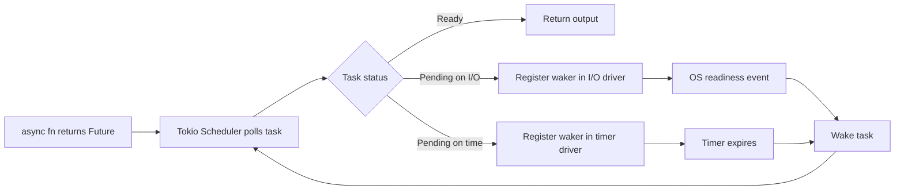

So think of Tokio as the operating layer for async Rust applications.

---

## The Core Mental Model: Futures, Polling, and Wakers

From Tokio’s async tutorial: a `Future` is the computation itself, not a background thread.

At runtime level, one poll cycle is basically:

1. Scheduler picks a task
2. Calls `Future::poll`
3. Task returns either:
   - `Poll::Ready(output)` (done)
   - `Poll::Pending` (not ready yet)
4. If pending, task must arrange to be woken later (via `Waker`)

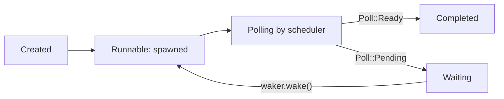

And the wake path:

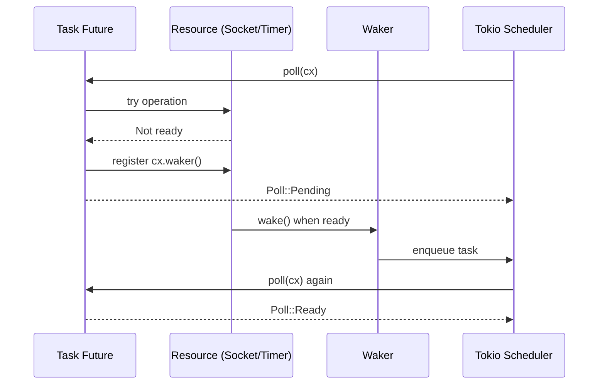

This is the heart of everything Tokio does.

---

## Tokio Runtime Architecture (Big Picture)

At a high level, the runtime architecture is:

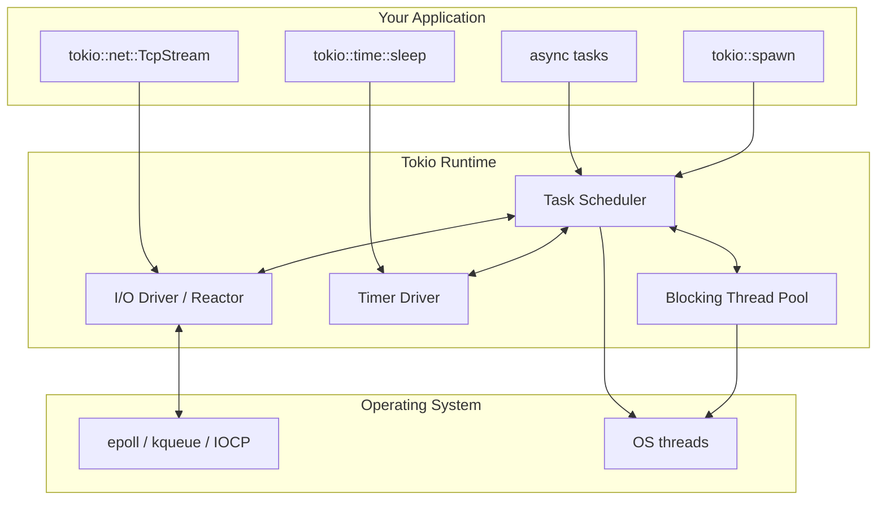

A few architecture truths worth remembering:

- Runtime behavior is highly optimized but some internals are **implementation details** and may evolve.
- Runtime configuration changes behavior materially (`current_thread` vs `multi_thread`).
- Resource drivers (`enable_io`, `enable_time`) matter when building runtime manually.

---

## Scheduler Design: Current-Thread vs Multi-Thread Runtime

Tokio’s runtime docs describe two major scheduler modes.

## Current-Thread Runtime

Single-threaded executor. Useful when you want deterministic single-thread behavior or very constrained deployment.

Documented behavior includes:

- Two FIFO queues: **local** and **global**
- Prefer local queue
- Check global queue when local is empty or after ~31 local picks (configurable)
- Check I/O/timers when no tasks or after ~61 scheduled tasks (configurable)
- No LIFO slot optimization here

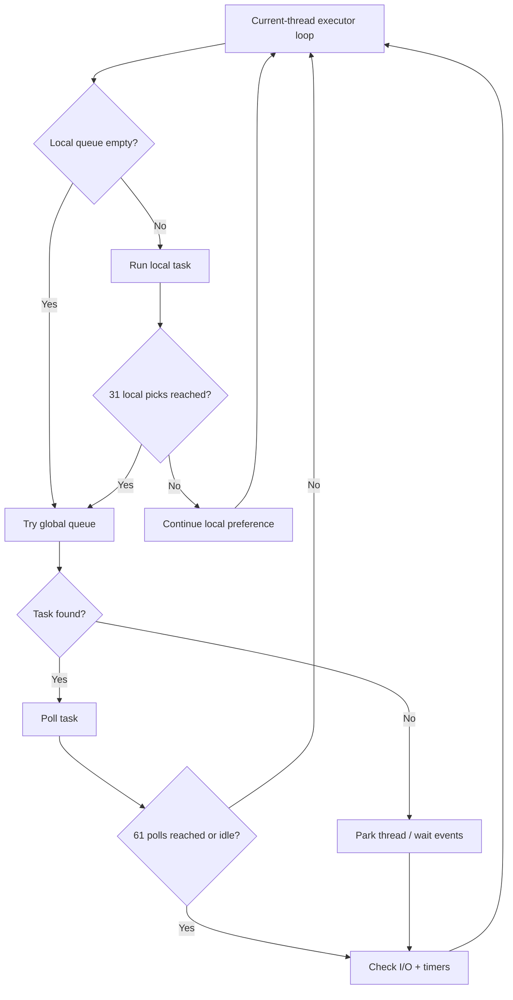

## Multi-Thread Runtime (Default for most apps)

This is Tokio’s common production setup.

Documented behavior includes:

- Fixed number of worker threads (typically tied to CPU core count unless configured)
- One global queue + one local queue per worker
- Local queue capacity is bounded (documented at 256 tasks currently)
- Overflow from local pushes work to global
- Work-stealing: idle workers steal from others (typically half)
- LIFO slot optimization to improve wake-to-run locality

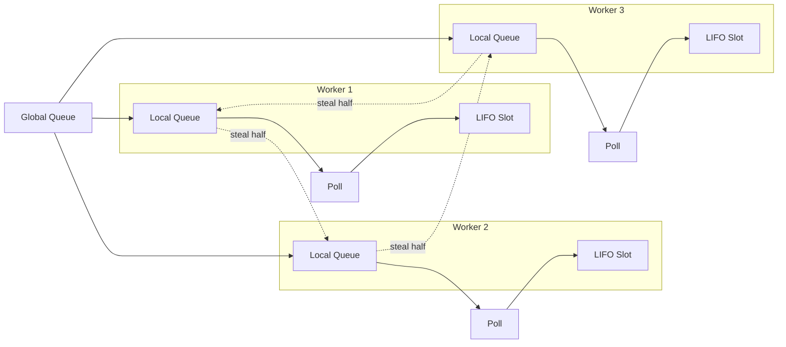

### Runtime choice quick rule

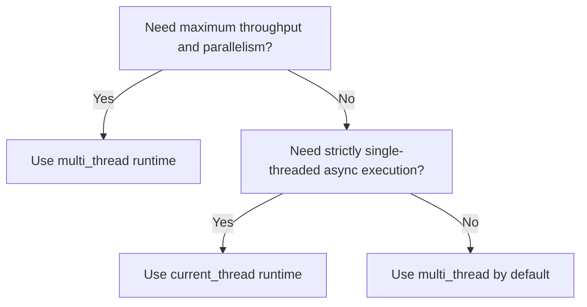

For most backend/network services: use `multi_thread` unless you have a specific reason not to.

---

## Reactor / I/O Driver Architecture (epoll, kqueue, IOCP via Mio)

Tokio’s I/O driver is backed by `mio`, which abstracts OS readiness APIs:

- Linux: `epoll`
- BSD/macOS: `kqueue`
- Windows: `IOCP` (through Mio abstraction paths)

The runtime registers I/O resources and parks workers when idle. On readiness, it marks resource state and wakes relevant tasks.

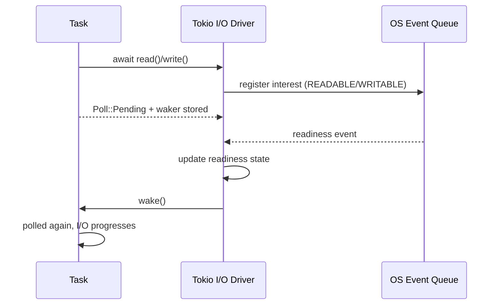

Architecturally, the reactor is what lets thousands of sockets be served by a smaller number of threads.

---

## Timer Architecture: Tokio’s Hashed Timing Wheel

Tokio timer internals are particularly elegant.

The time driver uses a **hierarchical hashed timing wheel** (documented in source comments), with millisecond resolution and six levels of wheels.

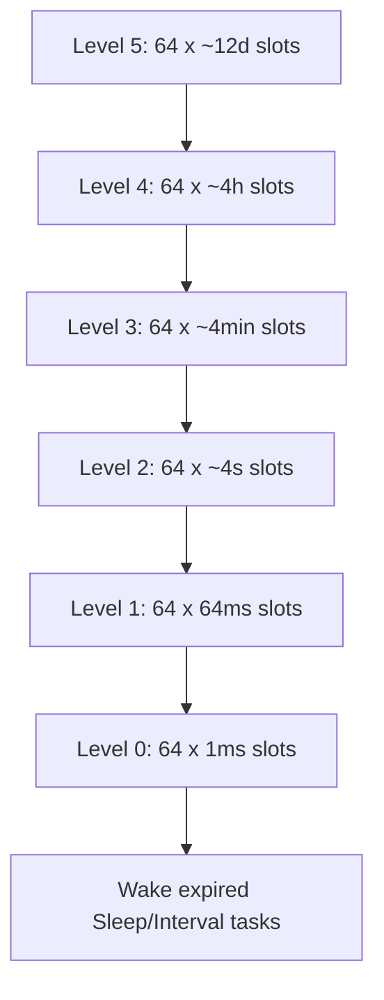

How it behaves conceptually:

1. Timers are inserted into coarse/fine slots based on deadline distance
2. As time advances, entries cascade downward across levels
3. At level 0, expired timers wake tasks

This gives good scaling for large numbers of timers.

---

## Blocking Boundaries: `spawn`, `spawn_blocking`, and `block_in_place`

One of the most important architectural disciplines in Tokio is: **don’t block async workers**.

| API | Runs where | Use for | Abort behavior |
|---|---|---|---|
| `tokio::spawn` | async worker threads | non-blocking futures | abortable via `JoinHandle::abort()` |
| `tokio::task::spawn_blocking` | dedicated blocking thread pool | CPU-heavy or blocking sync code | generally not abortable once started |
| `tokio::task::block_in_place` | converts current worker context (multi-thread runtime only) | short unavoidable blocking sections | use carefully |

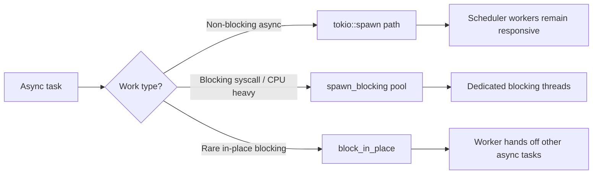

Example split:

```rust
use tokio::task;

async fn handle_request() {
    // Non-blocking async work
    let io_task = tokio::spawn(async {
        // await socket/db/network work
    });

    // Blocking / CPU-bound work
    let cpu_task = task::spawn_blocking(|| {
        // e.g. expensive parsing, compression, crypto, legacy sync SDK
        heavy_cpu_work()
    });

    let _ = io_task.await;
    let _ = cpu_task.await;
}

fn heavy_cpu_work() -> usize {
    (0..10_000_000).sum()
}
```

---

## Task Lifecycle, Cancellation, and Shutdown Semantics

Tokio tasks are cooperative. Cancellation is also cooperative.

From Tokio task docs:

- `JoinHandle::abort()` signals cancellation
- Task stops when it reaches a yield/await point
- Locals are dropped (destructors run)
- Awaiting join handle then returns cancelled error (if cancellation wins race)
- Runtime shutdown cancels outstanding async tasks

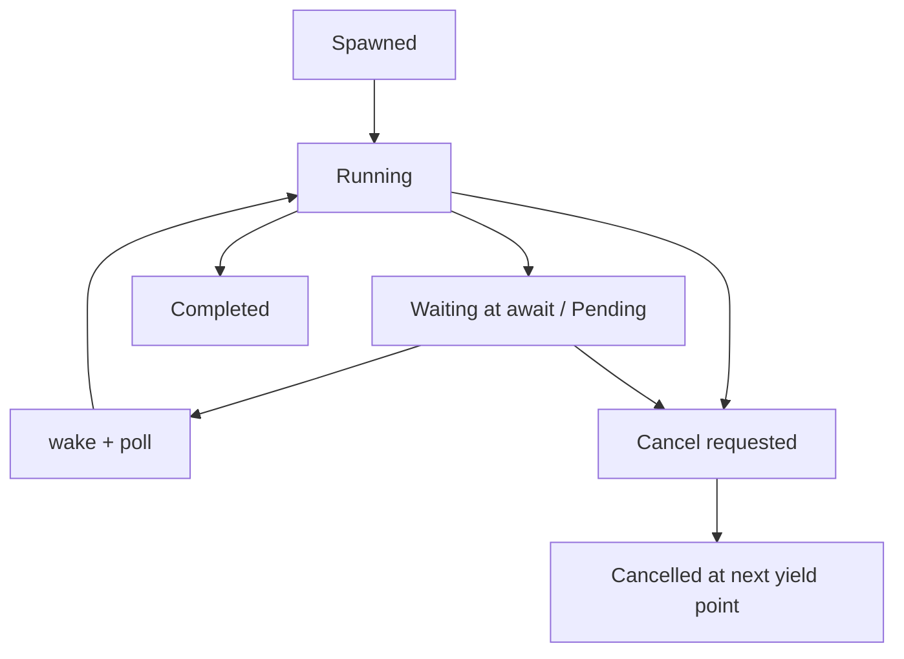

And shutdown path:

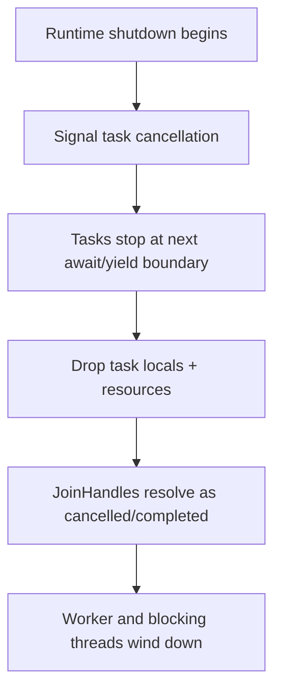

---

## End-to-End Request Flow Inside Tokio

Let’s put all runtime parts together in one production-style flow:

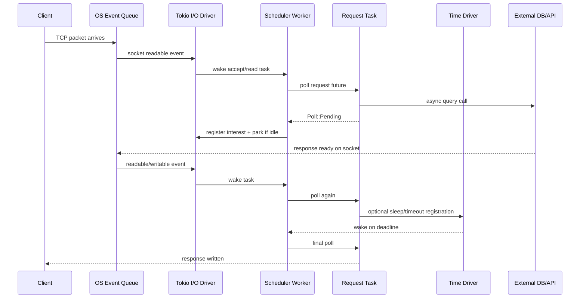

This is why Tokio can handle high concurrency with controlled thread counts.

---

## Practical Architecture Patterns for Production Tokio Apps

### 1) Prefer bounded channels for backpressure

```rust
use tokio::sync::mpsc;

let (tx, mut rx) = mpsc::channel::<Job>(1024); // bounded
```

Bounded channels help prevent unbounded memory growth when producers outrun consumers.

### 2) Separate I/O tasks from CPU-heavy tasks

- Keep protocol/network logic on async workers
- Offload heavy sync/CPU to `spawn_blocking`

### 3) Use cancellation-aware design

- Expect tasks to be cancelled at `.await` points
- Ensure cleanup is in `Drop` or explicit shutdown paths

### 4) Choose runtime flavor deliberately

- `multi_thread`: default for most network servers
- `current_thread`: deterministic single-thread async environments
- `LocalSet`: when you must run `!Send` futures

### 5) Keep fairness in mind

Tokio provides fairness guarantees under assumptions (bounded task count, non-blocking polls). If a task hogs execution without yielding, everyone else pays.

---

## Conclusion

Tokio’s architecture is the reason async Rust feels both high-performance and predictable:

- **Futures** are explicit state machines
- **Scheduler** drives progress via polling
- **Wakers** connect resource readiness to task rescheduling
- **Reactor** multiplexes massive I/O efficiently
- **Timer wheel** scales delayed work
- **Blocking boundaries** protect async workers

If you understand these building blocks, Tokio goes from “magic async crate” to a very clear, composable runtime design.

And once that clicks, designing high-concurrency Rust systems becomes much easier.

---

[^1]: Research references for this write-up:
    - Tokio tutorial (`Async in depth`): https://tokio.rs/tokio/tutorial/async
    - Tokio runtime docs (`tokio::runtime`): https://docs.rs/tokio/latest/tokio/runtime/
    - Tokio README (high-level architecture): https://github.com/tokio-rs/tokio
    - Tokio source comments for runtime/task/time internals (scheduler queues, timer wheel, cooperative scheduling)
